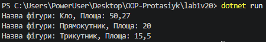

# Лабораторна робота №1
### __Тема:__ Створення першого проєкту. Класи, об’єкти, конструктори та деструктори. Середовище розробки.
### Варіант 20. Клас Figure
* Поля: name.
* *Властивість: Area.
* *Метод: GetFigure() -> повертає інформацію про фігуру.

# __Хід роботи:__
### Було встановлене середовище розробки VS Code з усіма необхідними розширеннями: C# Dev Kit; .NET Install Tool.
### У ході виконання лабораторної роботи №1 я створив консольний проєкт на C# у середовищі Visual Studio Code за допомогою команди dotnet new console lab1v20. Я розробив клас Figure, у якому реалізував приватне поле _name, публічну властивість Area, конструктор для ініціалізації початкових даних та метод GetFigure(), який повертає сформований рядок з інформацією про фігуру. У файлі Program.cs я створив три екземпляри класу з різними параметрами, викликав їхні методи та продемонстрував їхню роботу виводом у консоль. Наприкінці я налаштував файл .gitignore, ініціалізував Git-репозиторій у паці проєкту, зробив підсумковий коміт та відправив готовий код на GitHub.

### РЕзультат роботи:
### 