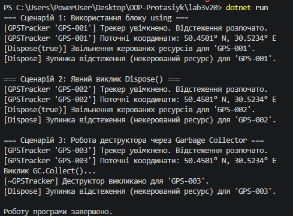

# Лабораторна робота №3: Життєвий цикл об’єкта та керування ресурсами

**Дисципліна:** Об’єктно-орієнтоване програмування  
**Навчальний заклад:** Рівненський фаховий коледж інформаційних технологій  
**Варіант:** 20 (`GPSTracker`)  

---

##  Мета роботи
Поглибити розуміння життєвого циклу об’єкта в C#, навчитися працювати з некерованими ресурсами, реалізувати інтерфейс `IDisposable` та патерн Dispose.

---

##  Завдання (Варіант 20)
Реалізувати клас `GPSTracker`, який імітує роботу з GPS-трекером та реалізує повний патерн Dispose:
 **Поля:** `_deviceId` (string), `_isTracking` (bool).
 **Метод:** `GetCurrentLocation()` — повертає координати, якщо відстеження активне.
 **Dispose:** Зупиняє відстеження та звільняє ресурси.

---

### Під час лабораторної роботи я створив консольний проєкт C# та реалізував клас `GPSTracker` з інтерфейсом `IDisposable`. У класі реалізував конструктор, метод `GetCurrentLocation()`, `Dispose()`, `Dispose(bool)` та деструктор. У `Main()` перевірив три способи звільнення ресурсів: через `using`, явний виклик `Dispose()` та за допомогою `GC.Collect()`. Після запуску програми перевірив правильність роботи всіх трьох сценаріїв у консолі.

### 
