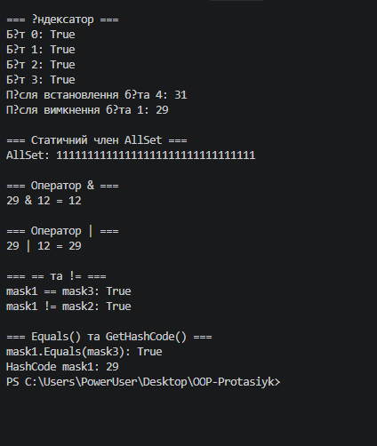

# **Лабораторна робота №4**

**### **Тема:** Властивості та статичні члени. Індексатори й перевантаження операторів.**

**### Варіант 20. Клас BitMask**

* Поле: `_maskValue (int)`.
* Властивість: `MaskValue`.
* Індексатор: `this[int bitIndex]` — доступ до конкретного біта.
* Статичний член: `AllSet` — маска з усіма встановленими бітами.
* Перевантажені оператори: `&`, `|`, `==`, `!=`.
* Методи: `ToString()`, `Equals()`, `GetHashCode()`.

# ****Хід роботи:****

**### Було встановлене середовище розробки VS Code з усіма необхідними розширеннями: C# Dev Kit; .NET Install Tool.**

**### У ході виконання лабораторної роботи №4 я створив консольний проєкт на C# у середовищі Visual Studio Code за допомогою команди `dotnet new console -o OOP-Protasiuk/lab4v20`. Я розробив клас BitMask, у якому реалізував приватне поле `_maskValue`, публічну властивість `MaskValue`, індексатор для роботи з окремими бітами та статичну властивість `AllSet`. Також було реалізовано перевантаження операторів `&` і `|` для виконання побітових операцій над об’єктами класу. Для порівняння об’єктів було перевантажено оператори `==` та `!=`, а також перевизначено методи `ToString()`, `Equals()` і `GetHashCode()`. У методі `Main()` я створив декілька об’єктів класу, продемонстрував роботу властивості, індексатора, статичного члена та перевантажених операторів. Результати роботи програми були виведені в консоль. Наприкінці я налаштував файл `.gitignore`, ініціалізував Git-репозиторій у папці проєкту, зробив підсумковий коміт та відправив готовий код на GitHub.**

**### Результат роботи:**

**### **
