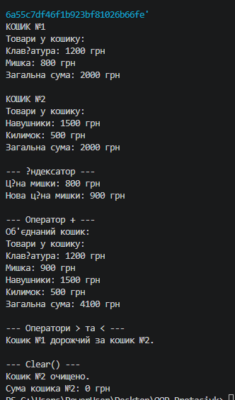

### # Лабораторна робота №5

### **Тема:** Індексатори та перевантаження операторів.

### **Варіант 20. Клас ShoppingCart**

* Поле: `_items` типу `Dictionary<string, decimal>` (товар → ціна).
* Індексатор: `this[string productName]`.
* Оператори: `+` — об'єднання кошиків, `>` та `<` — порівняння за загальною сумою.
* Методи: `Total()` — обчислення загальної суми, `Clear()` — очищення кошика.

# **Хід роботи:**

### У ході виконання лабораторної роботи №5 я створив консольний проєкт на C# у середовищі Visual Studio Code за допомогою команди `dotnet new console`. Я розробив клас `ShoppingCart`, у якому реалізував приватне поле `_items` типу `Dictionary<string, decimal>` для зберігання назв товарів та їхніх цін. Також було створено індексатор для доступу до товару за його назвою та перевантажено оператори `+`, `>` і `<`. Додатково реалізовано методи `Total()` для підрахунку загальної вартості товарів та `Clear()` для очищення кошика.

### У файлі `Program.cs` я створив два екземпляри класу `ShoppingCart`, додав до них різні товари та продемонстрував роботу індексатора: отримання і зміна ціни товару. За допомогою оператора `+` було об'єднано два кошики, а операторами `>` та `<` виконано порівняння їхньої загальної вартості. Результати роботи програми були виведені в консоль.

### Також були перевизначені методи `ToString()`, `Equals()` та `GetHashCode()`, відповідно до вимог лабораторної роботи.

### **Результат роботи:**

### 

