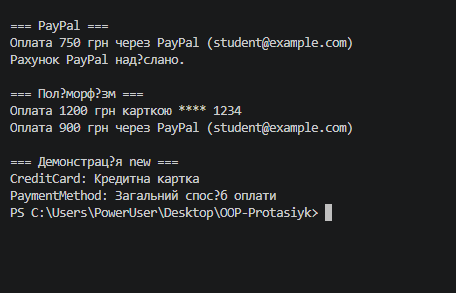

# Лабораторна робота №6

**Тема:** Успадкування та поліморфізм у C#.

**Варіант 20. Клас SearchEngine**

# Хід роботи:

У ході виконання лабораторної роботи №6 я створив консольний проєкт на C# у Visual Studio Code за допомогою команди `dotnet new console`.

Було реалізовано класи відповідно до завдання лабораторної роботи. Створено базовий клас та похідні класи з використанням успадкування та поліморфізму.

У програмі було створено об'єкти класів та продемонстровано роботу успадкованих методів. Також було перевірено правильність роботи програми та отримання результату в консолі.

Програму запущено за допомогою команди `dotnet run`.

# Результат роботи:

![Результат роботи]
